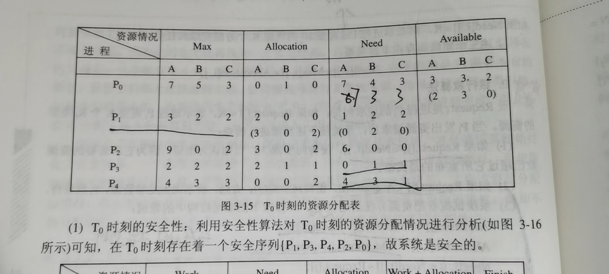
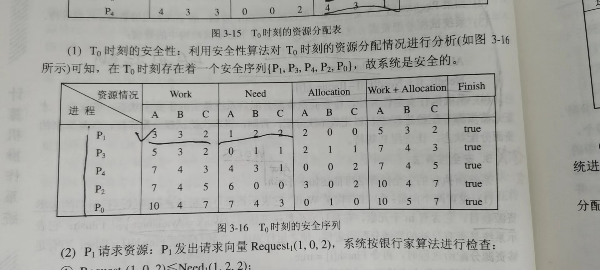

# OS仿真押题卷（一）

## 名词解释

### 临界资源？

系统中可以提供给多个进程使用，但规定在一段时间内只允许一个进程访问的资源叫做临界资源

### 操作系统内核？其主要功能？

现代操作系统一般将OS划分为若干层次，再将OS的不同功能设置在不同的层次中，通常将一些与硬件紧密相关的模块，各种常用设备的驱动程序以及运行频率较高的模块儿，都安排在紧靠硬件的软件层次中，将它们常驻内存，即通常被称为的**OS内核。**

**支撑功能**：中断处理、时钟管理、原语操作

**资源管理功能**：进程管理、存储器管理、设备管理

### PCB的作用？

PCB是进程实体的一部分，作用是是一个在多道程序环境下不能独立运行的程序，成为一个能独立运行的基本单位，称为能与其他进程并发执行的进程。OS是根据PCB对并发执行的进程进行控制和管理的，因此PCB是进程存在的唯一标志！

### 信号量？

保证两个或多个关键代码不被并发调用的一种多线程环境下的设施。主要有整型信号量，记录型信号量，AND型信号量（信号量集）

### 死锁？

死锁是指多个进程在运行过程中因争夺资源而造成的一种僵局，当进程处于这种僵持状态时，若无外力作用，它们都将无法再向前推进。
产生死锁的原因：竞争资源和进程推进顺序非法。其必要条件是：互斥条件、请求和保持条件、不可抢占条件、循环等待条件。

### 为什么要引入对换？对换可分为哪几种类型？

一方面，在内存中的某些进程由于事情尚未发生而被阻塞运行，但它却占用了大量的内存空间，甚至有可能出现内存中所有进程都被阻塞，而无可运行之进程，迫使CPU停止下来等待的情况；另一方面，却又有着许多作业，因内存空间不足，一直驻留在外存上，而不能进入内存运行。为此引入对换。
整体对换和页面（分段）对换。

### 虚拟存储器

是指具有请求调入功能和置换功能，能从逻辑上对内存容量加以扩充的一种存储器系统

### 内存抖动

抖动就是指当内存中已无空闲空间而又发生缺页中断时，需要从内存中调出一页程序或数据送磁盘的对换区中，如果算法不适当，刚被换出的页很快被访问，需重新调入，因此需再选一页调出，而此时被换出的页很快又要被访问，因而又需将它调入，如此频繁更换页面，使得系统把大部分时间用在了页面的调进换出上，而几乎不能完成任何有效的的工作，我们称这种现象为“抖动”。
产生抖动的原因是由于CPU的利用率和多道程序度的对立统一矛盾关系引起的，为了提高CPU利用率，可提高多道程序度，但单纯提高多道程序度又会造成缺页率的急剧上升，导致CPU的利用率下降，而系统的调度程序又会为了提高CPU利用率而继续提高多道程序度，形成恶性循环，我们称这时的进程是处于“抖动”状态。

### SPOOLING

为了缓和CPU的高速性与I/O设备低速性的矛盾，引入SPOOLING技术。该技术是利用专门的外围机先将低速I/O设备上的数据传送到高速磁盘上，或者相反。这样当处理机需要输入数据时，便可以直接从磁盘中读取数据，极大提高输入速度。反之，当处理机需要输出数据时，也可以很快的速度把数据输出到磁盘上。

### 中断

CPU对I/O设备发来的中断信号的一种响应。CPU暂停正在执行的程序，保留CPU环境后，自动地装去执行该I/O设备的中断处理程序，执行完后，再回到断点，继续执行原来的程序。

### 内存映像I/O

驱动程序将抽象I/O命令转换出的一系列具体的命令、参数等数据装入设备控制器的相应寄存器，由控制器来执行这些命令，具体实施对I/O设备的控制。从而实现访问内存与控制器的统一

### 文件分配表（FAT）

文件管理系统用来给每个文件分配磁盘物理空间的表格，它告诉操作系统，文件存放在磁盘的什么地方。因为增加盘块儿的容量是不方便和不灵活的，因此引入了簇的概念。簇是一组相邻的扇区，在进行盘块分配时，是以簇作为分配的基本单位。以簇位基本的分配单位的好处是，能适应磁盘容量不断增大的情况，还可以减少FAT表中的项数。

### 廉价磁盘冗余阵列（RAID）

即独立磁盘冗余阵列，简称为「磁盘阵列」，其实就是用多个独立的磁盘组成在一起形成一个大的磁盘系统，从而实现比单块磁盘更好的存储性能和更高的可靠性。

**RAID的分级**：RAID0级（实现并行传输，但是无荣誉校验功能，磁盘可靠性低），RAID1级（磁盘镜像功能，利用率为实际大小的一半，牺牲磁盘空间换取可靠性），RAID3级（利用一个磁盘实现奇偶检验功能），RAID5级（与3相比，将校验信息码发送至每个盘），RAID6级（在5的基础上引入了双层校验，不仅对每个磁盘有异或校验，对于每个数据块儿也有异或校验，提高了数据的冗余性）

**优点**：可靠性高（采用容错技术），磁盘I/O速度高（采用并行交叉存取方式，提高磁盘I/O速度），性价比高

## 问答题

### 设计现代操作系统的目标？

有效性、方便性、可扩展性、开放性

### OS的作用可以表现在哪些方面？

作为用户与计算机硬件系统之间的接口、作为计算机系统资源的管理者、实现对计算机资源的抽象

### OS对于计算机系统资源的抽象？

第一层抽象：在裸机上覆盖I/O管理软件实现对计算机硬件的第一层抽象；第二层抽象：在第一层软件上覆盖文件管理软件，实现对硬件资源操作的第二层抽象；第三层抽象：在计算机硬件上安装多层系统软件，增强系统功能，隐藏硬件操作细节，共同实现计算机资源抽象。

### 引入进程的原因？

为了使程序在多道程序下能够并发执行，并对并发执行加以控制和描述

### PCB提供了进程管理和进程调度所需要的哪些信息？

进程管理：程序和数据的地址、进程同步和通信机制、资源清单、链接指针
进程调度：进程状态、进程优先级、事件、其他信息

### 试从调度性、开发性、拥有资源及系统开销方面对进程和线程进行比较。

**调度性**：在传统的操作系统中，拥有资源的基本单位和独立调度、分派的基本单位都是进程，在引入线程的OS中，则把线程作为调度和分派的基本单位，而把进程作为资源拥有的基本单位；
**并发性**：在引入线程的OS中，不仅进程之间可以并发执行，而且在一个进程的多个线程之间，亦可并发执行，因而使OS具有更好的并发性；
**拥有资源**：无论是传统的操作系统，还是引入了线程的操作系统，进程始终是拥有资源的一个基本单位，而线程除了拥有一点在运行时必不可少的资源外，本身不拥有系统资源，但它可以访问其隶属进程的资源；
**开销**：由于创建或撤销进程时，系统都要为之分配和回收资源，如内存空间等，进程切换时所要保存和设置的现场信息也要明显地多于线程，因此，操作系统在创建、撤销和切换晋城市所付出的开销将显著的大于进程。

### 进程在三个基本状态之间转换的典型原因？

处于就绪态的进程，在调度程序为之分配了处理机之后便可执行，相应地，其状态就由就绪态转变为执行态；
正在执行的进程如果因分配给它的时间片已完而被剥夺处理机暂停执行时，其状态便由执行态转为就绪；
如果因发生某事件，致使当前进程的执行受阻，使之无法继续执行，则该进程状态将由执行转变为阻塞。

### 在批处理系统、分时系统和实时系统中，各采用哪几种进程（作业）调度算法？

批处理系统常用调度算法：
①先来先服务：FCFS
②最短作业优先
③最短剩余时间优先
④响应比最高者优先
分时系统调度算法：
①轮转调度
②优先级调度
③多级队列调度
④彩票调度
实时系统调度算法：
①单比率调度
②最早截止时间调度算法
③最低松弛度调度算法

### 分页和分段存储管理有何区别？

（1）页是信息的物理单位，分页是为了实现离散分配方式，以削减内存的外部零头，提高内存的利用率。段则是信息的逻辑单位，它含有一组相对完整的信息。
（2）页的大小固定且由系统决定，由系统把逻辑地址划分为页号和页内地址两部分，是由机械硬件实现的，因而在系统中只能有一种大小的页面；而段的长度却不固定，决定于用户所编写的程序，通常由编译程序在对原程序进行编译时，根据信息的性质来划分。
（3）分页的作业地址空间是一维的，而分段作业地址空间则是二维的。

### 分页管理&分段管理

实现普通存储中较高的碎片空间利用率。分页（段）管理中利用页（段）表实现离散存储，将合适的内容存入页中，实现合理空间利用。另外，地址变换是在寄存器中实现的，因为页（段）表内容太多，考虑到经济原因，将其放入内存中，但是添加快表（特殊高速缓冲寄存器）作为缓冲，可以提高访问速度

### 说明I/O系统的基本功能。

隐藏物理设备的细节、与设备的无关性、提高处理机和I/O设备的利用率、对I/O设备进行控制、确保对设备的正确共享、错误处理

### 简要说明I/O软件的4个层次的基本功能。

中断处理程序：用于保存被中断进程的CPU环境，转入相应的中断处理程序进行处理，处理完后恢复现场，并返回到被中断的进程
设备驱动程序：与硬件直接有关，用来具体实现系统对设备发出的操作指令，驱动I/O设备工作
设备独立性软件：用于实现用户程序与设备驱动器的统一接口、设备命令、设备保护，以及设备分配与释放等。
用户层I/O软件：用于实现用户与I/O设备交互

## 应用题

### 银行家避免死锁算法的模拟?

银行家算法就是判断提出的申请资源的请求会不会发生死锁，因此首先用银行家算法修改状态表，安全算法得出安全序列。

首先判断请求资源是否超出已声明的需求量，若没有，则将需求量减去申请的资源数目；然后判断请求资源是否超过可用资源数目，若未超过，则将可用资源数目减去申请资源；之后利用安全算法模拟得出安全序列。

利用已经计算好的状态表，将可用资源作为work向量，找到需求量小于它的进程，然后将其已分配资源与工作向量的资源作为下一个满足要求的工作向量，并将当前进程的finish标记为true。

### 进程调度算法模拟（EDF，LLF，RR，优先）调度？

### 内存管理页面置换算法（虚拟存储）？

最佳置换算法（OPT），先进先出算法（FIFO），最近最久未使用算法（LRU）使用寄存器记录使用时间用硬件实现，最少使用算法（LFU）利用特殊的栈来记录最近使用的页面用硬件实现，Clock置换算法利用标记位来记录已经访问过的页面。