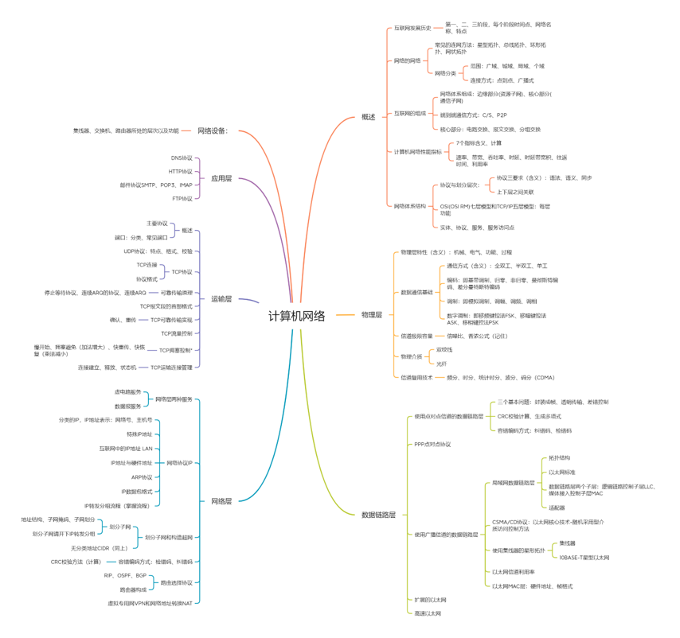
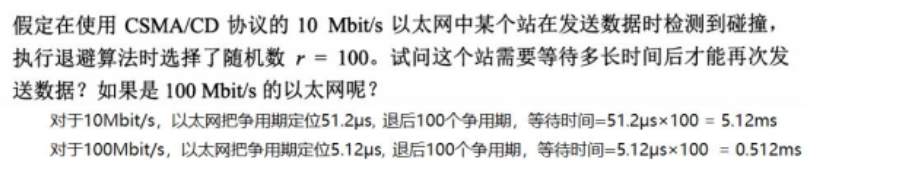
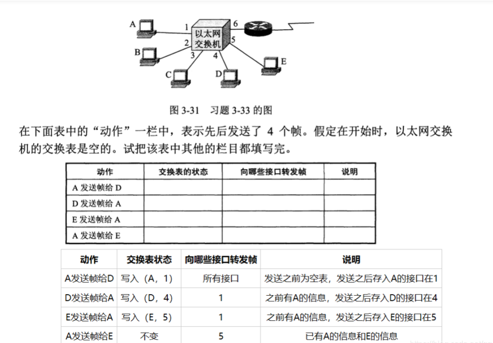

# 计算机网络考前复习易错点整理

## 第一章

### internet与Internet的区别

-  internet（互联网或互连网）：通用名词，它泛指由多个计算机网络互连而成的网络。
- Internet（因特网）：专用名词，特指采用 TCP/IP 协议的互联网络。

### 计算机网络性能指标

速率与时延的计算

1. bps指的是bit/s，而一般情况下对于文件大小用B（字节）表示，1B=8bit
2. 计算分组交换的发送时延时，结点是特指** 路由器**，因为只有在路由器中才进行分组发送

### 协议与服务的区别

网络协议：为进行网络中的数据交换而建立的规则、标准或约定。由以下三个要素组成：
（1）语法：即数据与控制信息的结构或格式。
（2）语义：即需要发出何种控制信息，完成何种动作以及做出何种响应。
（3）同步：即事件实现顺序的详细说明。协议是控制两个对等实体进行通信的规则的集合。在协议的控制下，两个对等实体间的通信使得本层能够向上一层提供服务，而要实现本层协议，还需要使用下面一层提供服务。
协议和服务的概念的区分：
1、协议的实现保证了能够向上一层提供服务。本层的服务用户只能看见服务而无法看见下面的协议。下面的协议对上面的服务用户是透明的。
2、协议是“水平的”，即协议是控制两个对等实体进行通信的规则。但服务是“垂直的”，即服务是由下层通过层间接口向上层提供的。上层使用所提供的服务必须与下层交换一些命令，这些命令在OSI中称为服务原语。

## 第二章 物理层

## 第三章 数据链路层

### CRC中的生成多项式

类似于二项式展开，如果该位为1，则x的n次幂系数为1

### 异步传输采用字节填充，同步传输采用零比特填充

0x7E--->0x7D,0x5E

0x7D--->0x7D,0x5D

出现连续5个1，插入一个0，接收端进行判断并删掉0

### 集线器与交换机

关于碰撞域与吞吐量的问题，总吞吐量为所有碰撞域中带宽的总和。

集线器只会简单的将收到的数据依次传给每个端口，因此一个集线器形成一个碰撞域，另外集线器下的主机共享该集线器的速率。

交换机也被称为交换式集线器，多接口网桥=》因此可以理解为网桥转发时的做法与交换机自学习一致

### CSMA/CD协议解决发送时数据碰撞

常识：电磁波在1KM电缆的传播时延为5us；以太网使用半双工通信；以太网所容许最小帧的大小为（64+8）*8bit

其中一个站发送信息后，**最迟**要经过两倍的总线端到端的传播时延（2t），即协议的帧长至少为2t*发送速率（数据率）

**截断二进制退避（确定重传时机）**：

1. 具体的争用期时间为51.2us（10Mbit/s的以太网），可发送64字节，即512比特时间，选取随机数获得r倍争用期的退后时间

### 以太网交换机自学习

动作：

- ​	更新交换表（写入源MAC地址和对应端口）
- ​    向目的地址转发数据帧，如果交换表中没有就进行广播（向所有接口都转发）

以太网交换机不使用CSMA/CD协议，使用全双工通信，因为使用的是以太网的帧结构，所以被称作以太网交换机

### 以太网MAC帧

以太网的数据帧为64字节（固定大小），数据不足的需要添加字段填充----保证一个争用期传输的数据大小，确保争用期内可以检测碰撞。首部（源地址4，目的地址4，类型2）+尾部（校验序列FCS--4）

## 第四章 网际层

### IP分类

IP地址中的点分十进制为十进制数，在进行二进制转换为16进制时需要注意

广播地址是指主机号为全1的地址，不能用作IP地址，主机号全0代表本主机，因此每个网络ID号下可用主机个数-2为实际可用主机IP地址数

### IP数据格式

IP数据报的首部大小固定为20字节，所以计算分片的时候，根据MTU的大小，减去首部之后才能得到实际数据部分，另外分片是根据数据首个位置除以8

IP数据报的IP首部中设置标识字段用来实现分片时的标识，以及标记字段MF（more）DF（Don't）

### ARP协议

每一台主机都设有一个ARP高速缓存，里面缓存本局域网个主机路由器的IP地址到硬件地址的映射表

### CIDR（无分类域间路由选择）

根据最长的相同前缀进行聚类，得到最小地址---聚合CIDR地址块

另外通过确定前缀号进行局域网分配，根据局域网需要主机的个数，确定网络前缀。

### ICMP协议

网际控制报文协议，转发IP数据报和提高交付成功的机会

### RIP（路由表的更新）

好消息传得快，坏消息传得慢（RIP路由表更新时间小于自动路由表更新时间，引起出错距离==>特指16经过很多轮循环才正确）

相同网络：

- 不同下一跳，将该条记录更新为距离更近的下一跳
- 相同下一跳，更新该条记录的距离为新来的记录的距离

### 互联网IP配置

#### 路由器

路由器的端口IP与其相连接的子网的子网掩码相与后得到的是该子网的网络号，另外，端口IP不能直接是网络号，应为正确IP区间网络号（主机号全0+1~主机号全1-1）除已使用的IP地址外的IP地址

#### 主机

主机不能为网络号+主机号全1，因为该地址为广播地址，配置的区间同样为应为正确IP区间网络号（主机号全0+1~主机号全1-1）除已使用的IP地址外的IP地址；另外主机的IP地址与该主机所在网络子网掩码相与后应等于网络号，且该主机IP不能直接为网络号，即主机号为0，或者主机号为全1（广播地址）

## 第五章 运输层

### UDP校验和的计算

根据UDP首部中给出的校验和字段大小，2字节，将伪首部+UDP首部所有数据进行二进制反码求和运算得到校验和

### TCP数据报数据部分大小

根据IP数据报首部的总长度字段确定，最大为2^16-1=65535字节，去掉IP固定首部（20字节）和TCP首部最小长度（20字节）为TCP数据报数据部分最大长度为65495字节

TCP报文中可出现的序号数为2^32-1,因为序号位为32位

### 从运输层来看吞吐量

吞吐量是指传输实际数据过程的速率，即数据量/真实时间，其中真实时间为发送时间+一个往返的传输时间。

### 超时重传时间的计算

$$
RTTs=(1-a)*RTTs(旧的)+a*新的RTT样本----其中a为0.125，第一次计算时RTT即为RTTs
$$

$$
RTO=RTTs+4*RTTD
$$

$$
RTTD=(1-b)*RTTD(旧的)+b*|RTTs-新的RTT样本|--其中b为0.25，第一次计算时RTTD为RTT一半
$$

## 第六章 应用层

DHCP动态主机配置协议，荀彧一台计算机加入新的网络和获取IP地址而不用手工参与

### 邮件协议

SMTP邮件发送协议，POP3邮件读取协议，收件人所连接的ISP邮件服务器中读取，另外读取后进行删除